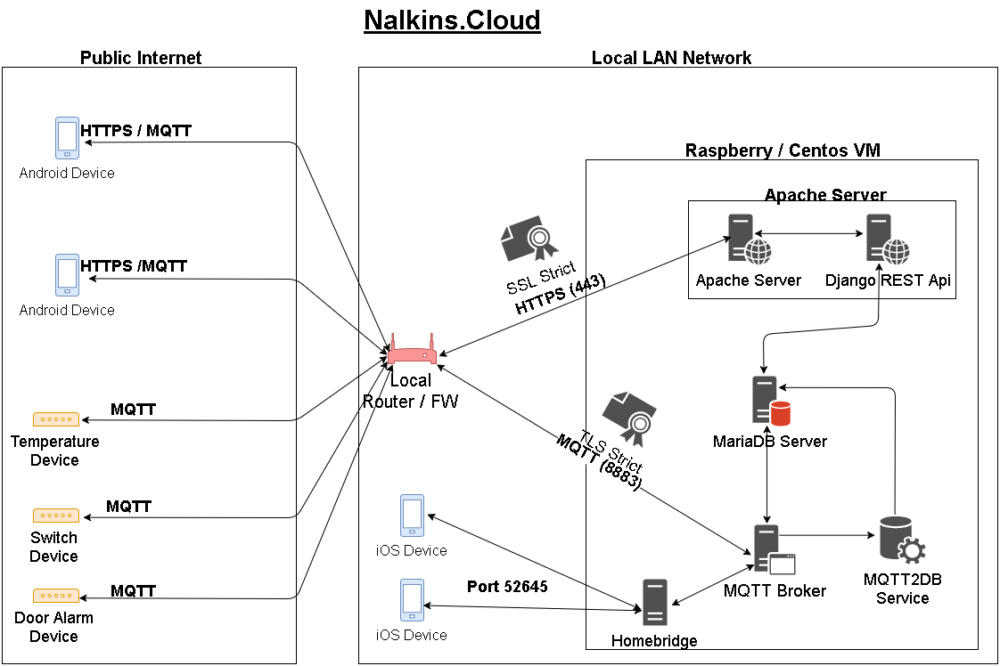

NalkinsCloud
============
This is an IOT Automation project, 
it will provide the ability to monitor and control your indoor\outdoor devices from anywhere.
Project uses server side written in python, 
hardware written in C++ based on the ESP8266 chip, 
android application in Java, and small NodeJS server to support IOS clients.



Getting started
---------------
What will you do:
* Choose Hardware - Use [Raspberry Pi](https://www.raspberrypi.org/learning/hardware-guide/) with [Raspbian](https://www.raspberrypi.org/downloads/raspbian/) or VM/PC with [Centos7](https://www.centos.org/download/) as your server.
* Install web server - Setup [Django](https://www.djangoproject.com/) running under [Apache Server](https://httpd.apache.org/), configure full SSL encryption, and clone [NalkinsCloud-Django](https://github.com/ArieLevs/NalkinsCloud-Django).
* Install database - Setup [MariaDB server](https://mariadb.org/) to support all components.
* Install MQTT Broker - Setup [Mosquitto server](https://mosquitto.org/), And set full TLS encryption.
* Install Mosquitto Auth - Integrate [Mosquitto Auth-Plug](https://github.com/jpmens/mosquitto-auth-plug) to Mosquitto.
* Setup message listener - Setting up mqtt2db service, that will act as a listener injecting messages to database.
* Install Homebridge - Setup [Homebridge Server](https://github.com/nfarina/homebridge) With [MQTT support](https://github.com/cflurin/homebridge-mqtt) so you could use iOS with this project.
* Build your hardware - Use various custom devices, that you will build yourself, And clone [NalkinsCloud-ESP8266](https://github.com/ArieLevs/NalkinsCloud-ESP8266) to ESP8266.
* Use Android - Clone [NalkinsCloud-Android](https://github.com/ArieLevs/NalkinsCloud-Android), build apk and start controlling your devices.
* Use iOS - Use Apple homekit application to control devices.


Installation
------------
All services and code will setup on the same machine, Centos7 or Raspberry Pi 4.9.59-v7+

Start by installing Raspberry pi, download [RASPBIAN STRETCH LITE](https://www.raspberrypi.org/downloads/raspbian/)
And create micro-sd with that image (Rufus is recommended).  
Based on: Linux raspberrypi 4.9.59-v7+ # armv7l GNU/Linux

For setting up the project on Centos7 OS [Download iso image](https://www.centos.org/download/),
If you need assistance to make the USB installation [use this guide](https://wiki.centos.org/HowTos/InstallFromUSBkey).  
Based on: CentOS Linux 7 Kernel: Linux 3.10.0-693.5.2.el7.x86_64

- For additional assistance please search on how to install the OS

#### If you choose Raspberry Pi you will need to configure it for SSH use
Connect the Raspberry Pi to a monitor and keyboard, once OS is up:

Default login user is `pi` and password is `raspberry`, Change the password:  
Type `passwd`  
Add user to sudoers and start ssh service
```
sudo usermod -aG sudo pi
sudo systemctl enable ssh
sudo systemctl start ssh
```

If you wish to use Wi-Fi connection please [Connect Raspberry using Wi-Fi](https://www.raspberrypi.org/documentation/configuration/wireless/wireless-cli.md),  
Else connect Raspberry via LAN cable to one of your router ports.  
 
* optional: install VIM editor (Internet connection needed) `sudo apt-get install vim`  
  Allow mouse right click to past clipboard to terminal on vim editor
```
sudo vim /usr/share/vim/vim80/defaults.vim
#Append: (Comment each line with ")
	"if has('mouse')
	"  set mouse=r
	"endif
```

Setup Static IP: (Change with your relevant LAN ip)
`sudo vim /etc/dhcpcd.conf`  
Append to buttom of page:
```
interface eth0
	static ip_address=192.168.0.10/24
	static routers=192.168.0.1
	static domain_name_servers=192.168.0.1
```
Then `sudo reboot`  
Now SSH to the Respberry with 192.168.0.10, Then you could leave your pi near the router

secure the connection:
```
cd $HOME
ssh-keygen
```
OK so now we have two files: id_rsa and id_rsa.pub at `$HOME/.ssh` directory
	
The id_rsa (private key) should be moved to the client (To each machine you will be connecting the Raspberry from, AND KEPT SECURE)
```
cat $HOME/.ssh/id_rsa.pub >> $HOME/.ssh/authorized_keys #add the key
chmod 600 $HOME/.ssh/authorized_keys
```
Disable password connection `sudo vim /etc/ssh/sshd_config`  
Change `ChallengeResponseAuthentification no` to `PasswordAuthentification no` and save the file.  
Finally run `sudo service ssh reload`

* If using [putty](http://www.putty.org/) to ssh, open puttygen and convert the private key (id_rsa) to .ppk file (import key then save as private key)
	
Set up firewall:
```
sudo apt-get install ufw
sudo ufw allow ssh
sudo ufw enable
```

### Before you begin
If you use registered domain name and not dynamic IP address, I strongly recommend using Letsencrypt certificates instead of self-signed,
If you do not have registered domain, I recommend using DDNS services as [no-ip](https://www.noip.com/remote-access), 
This will allow you to use your own domain name pointing to your local WAN address,
by installing an agent on the server (or even your router), the agent will constantly sync your dynamic ip address,
so you will have access from public internet.

### Project installation
First [install Ansible](https://docs.ansible.com/ansible/latest/installation_guide/intro_installation.html) on your machine.  
Clone repository:
```
git clone https://github.com/ArieLevs/NalkinsCloud.git
```

* You can update `vim NalkinsCloud/group_vars/all`, if vars are not updated, defaults will be installed.
* Update `inventory` file, with relevant address of the destination installation,
  So if the host was set to `192.168.0.10` as shown before, set this value.
```
ansible-playbook -i inventory \
    -Kb -u [USERNAME] \
    -e"mosquitto_host=[MOSQUITTO_HOST_GROUP] \
    database_host=[DB_HOST_GROUP] \
    django_hoss=[DJANGO_HOST_GROUP] \
    mqtt_simulators_host=[SIMULATORS_HOST_GROUP]" \
    NalkinsCloud/nalkinscloud_deploy.yml \
    --key-file "[SSH_KEY]"
```

#### Important:
Once installation finished successfully, save all passwords from **NalkinsCloud/group_vars/all** file, 
I recommend using password management application like [KeePass](https://keepass.info/), 
Then you PERMANENTLY remove these password.

Post Installation
-----------------
Ansible will store a .bks file at `/tmp/[MOSUITTO_HOST]/etc/ssl/certs` on your local machine (by default),  
This file will later be needed in order for the android app to work.

Go to `Application` page in django admin, *Please change domain with relevant IP\Domain*.
	https://www.nalkins.cloud/admin/oauth2_provider/application/add/ 
```
Choose:
	Client type: Confidential
	Authorization grant type: Resource owner password-based
	Name: Android (To your choice)
	
	And save
```
We have just created an application so django can serve clients  
Please note for 'Client id' and 'Client secret' which are important for our clients to receive tokens.

### Setting up ESP8266 device
Please walkthrough [NalkinsCloud-ESP8266](https://github.com/ArieLevs/NalkinsCloud-ESP8266)

### Android Application
Please walkthrough [NalkinsCloud-Android](https://github.com/ArieLevs/NalkinsCloud-Android)

Conclusion
----------

OK so what we've done here,  
We've installed MariaDB server that will serve both client and devices,  
Installed Django application,   
Installed Mosquitto server that serve subscriptions and publish of messages.
